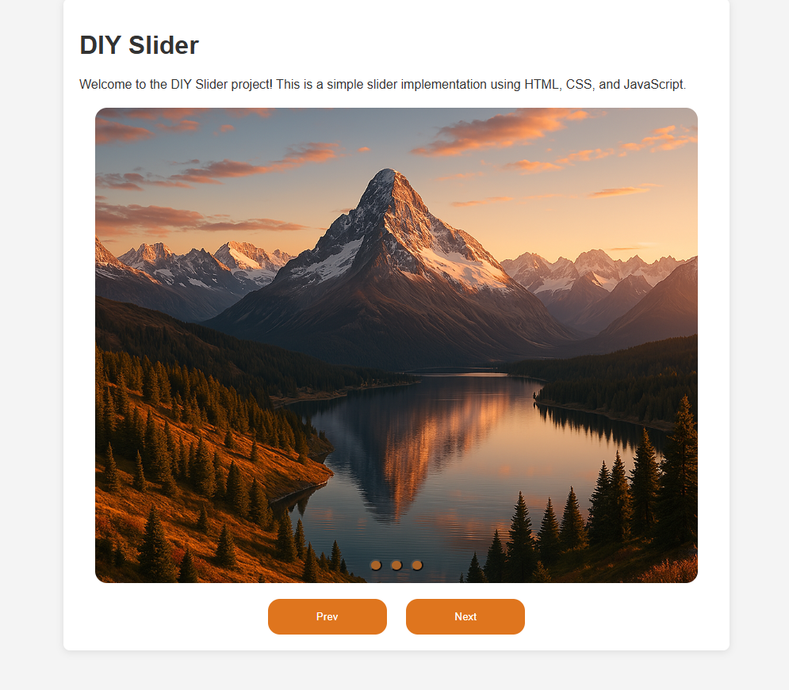

# DIY Slider

Bu proje, JavaScript ile oluşturulmuş basit bir DIY görüntü kaydırıcıdır. Kullanıcıların görüntüler arasında kolayca gezinmesini sağlar.

## Özellikler
- Akıcı görüntü geçişleri
- Duyarlı tasarım
- Kolay özelleştirme

## Kurulum
1. Depoyu klonlayın:
    ```bash
    git clone https://github.com/your-repo/diy-slider.git
    ```
2. `index.html` dosyasını tarayıcınızda açın.

## Kullanım
- Görsellerinizi `images` klasörüne ekleyin.
- Görsel yollarını JavaScript dosyasında güncelleyin.


This project is a simple DIY image slider built with JavaScript. It allows users to easily navigate between images.

## Features
- Smooth image transitions
- Responsive design
- Easy customization

## Installation
1. Clone the repository:
    ```bash
    git clone https://github.com/your-repo/diy-slider.git
    ```
2. Open the `index.html` file in your browser.

## Usage
- Add your images to the `images` folder.
- Update the image paths in the JavaScript file.

## Preview
